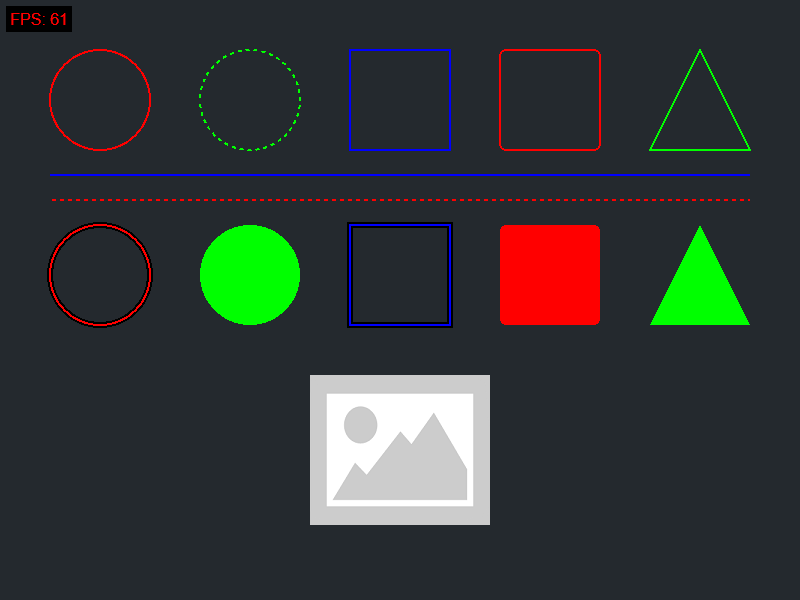

# GameOverlay.Net

This library offers a comprehensive interface for drawing hardware accelerated graphics using our [Direct2D1 renderer](/source/Drawing/Graphics.cs "Direct2D1 renderer") and creating transparent click-through windows.

### NuGet

Install from GitHub packages  :)

# Features

- Supports Windows 7, 8, 8.1 and 10
- Hardware accelerated
- Create transparent overlay windows
- Make your overlay stick to a parent window
- Draw Text, Lines, Rectangles, Circles, Triangles...
- Load and Draw images (.bmp, .png, .jpg)
- Multithreaded rendering
- Already implemented render loop with fps limitation

# Contribute

The project file was generated using Visual Studio 2017.

Clone or download the repository and update/install the required NuGet packages.

You can help by reporting issues, adding new features, fixing bugs and by providing a better documentation.  

### Dependencies

    SharpDX.Direct2D1, SharpDX.DXGI, SharpDX

# License

- [GameOverlay.Net License](LICENSE "GameOverlay.Net License")
- [SharpDX License](https://github.com/sharpdx/SharpDX/blob/master/LICENSE "SharpDX License")

# Special Thanks

- [BigMo (Zat)](https://github.com/BigMo "BigMo (Zat)") for his [SharpDXRenderer](https://github.com/BigMo/ExternalUtilsCSharp/tree/master/ExternalUtilsCSharp.SharpDXRenderer "SharpDXRenderer")
- [ReactiioN](https://github.com/ReactiioN1337 "ReactiioN") for his [C++ aero-overlay](https://github.com/ReactiioN1337/aero-overlay "C++ aero-overlay")
- [SharpDX](http://sharpdx.org/ "SharpDX") for their open source DirectX wrapper
